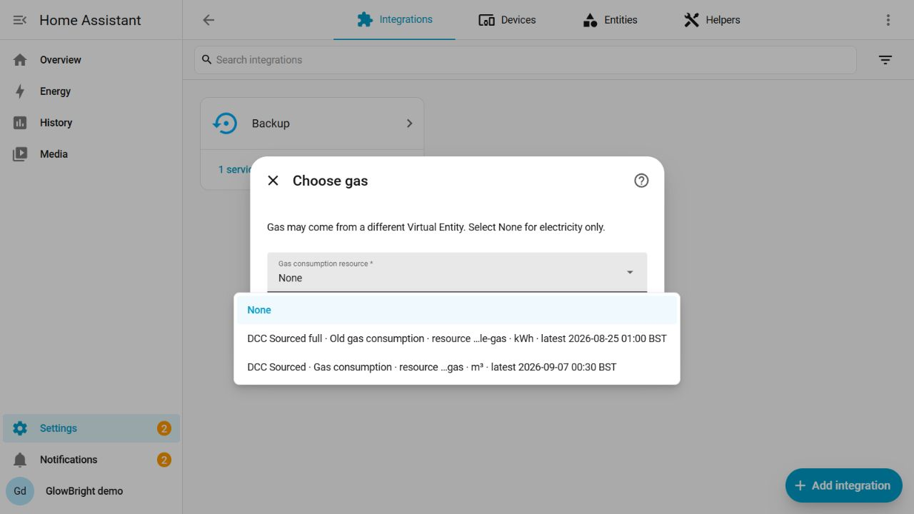
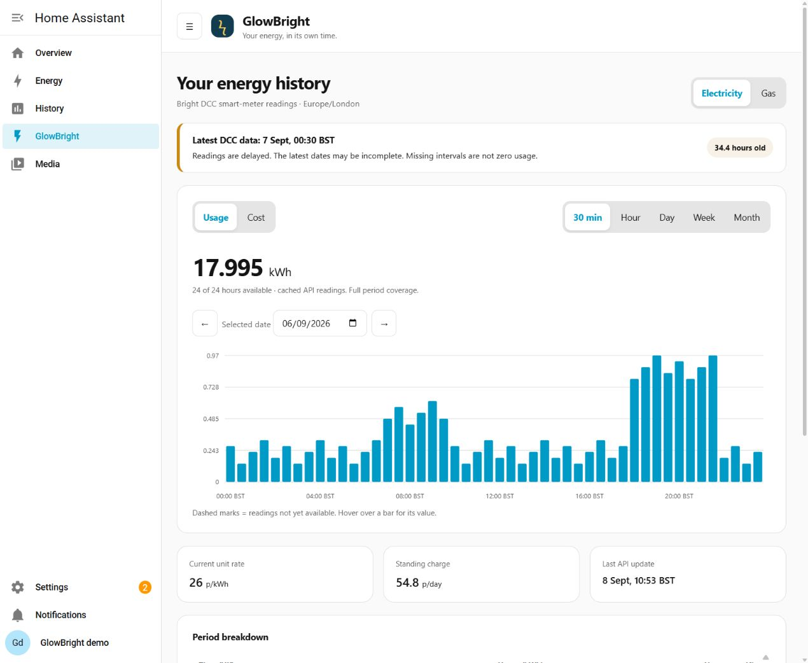
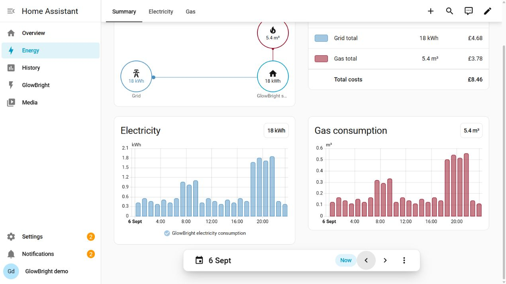

# GlowBright

An unofficial Home Assistant integration for Hildebrand Glowmarkt / Bright DCC
smart-meter history. Requires **Home Assistant 2026.9 or later**.

**Current version: 0.1.0rc1**, the first numbered release candidate.
See [releases](https://github.com/baileyboy0304/homeassistant-glowbright/releases)
and the [changelog](CHANGELOG.md). Stable 0.1.0 awaits the remaining real-account
acceptance checks in [VALIDATION.md](VALIDATION.md).

DCC readings commonly arrive **24–48 hours late**. GlowBright imports each hour
at its original consumption time. If Monday's readings arrive Wednesday, Monday
changes; Wednesday does not receive a consumption spike. The most recent seven
days are re-fetched and revisions update all affected cumulative sums.

This is different from real-time Glow CAD/MQTT: DCC does not provide instant power
or a reliable live “usage today” total. GlowBright is independently developed and
is not an official Hildebrand or Bright product. It does not use Octopus APIs.

## Install and configure

The release candidate is available through HACS custom repositories:

1. In HACS, open **Custom repositories**, add
   `https://github.com/baileyboy0304/homeassistant-glowbright`, category **Integration**.
2. Download GlowBright and restart Home Assistant.
3. Open **Settings → Devices & services → Add integration → GlowBright**.
4. Enter your existing Bright username/email and password in Home Assistant.
5. Select electricity, then independently select gas or **None**. Labels show the
   Virtual Entity, resource name, ID suffix, unit and latest data timestamp.
6. Select historical cost resources if available and confirm.

For release candidates, enable GlowBright's pre-release switch under the HACS
integration's entities (the switch may initially be disabled). HACS then includes
pre-releases in update checks; see [HACS's switch documentation](https://hacs.xyz/docs/use/entities/switch/).
Select **v0.1.0rc1** when downloading/redownloading, then restart Home Assistant.
The default branch remains a development snapshot and can display a commit hash.

Every published version has a matching Git tag, GitHub release and integration
version. Release candidates use `0.1.0rc1`, `0.1.0rc2`, and so on; stable releases
use `0.1.0`, with subsequent fixes incrementing the patch number.

An account can contain multiple Virtual Entities and multiple resources with the
same classifier. Electricity from “DCC Sourced full” and gas from “DCC Sourced”
can be selected together. Cost choices are restricted to the selected fuel's VE.
No cost resource is required for consumption to work.

History imports in the background, initially up to 365 days or the API's earliest
available reading. Backfill progress survives a restart and completed chunks are
kept when a later request fails.

**Configure** changes resources, backfill depth, refresh window, gas conversion
and panel visibility. Changing a fuel resource clears and rebuilds only that
fuel's GlowBright statistics. Its Energy selection keeps the same statistic ID;
the other fuel's history remains intact. A deeper backfill recomputes subsequent
sums. Reconfigure/reauthenticate with the same Bright account identity.

## Home Assistant Energy setup

Wait until GlowBright has imported data, then open
**Settings → Dashboards → Energy**.

| Setting | Select |
| --- | --- |
| Electricity → Consumed energy | **GlowBright electricity consumption** external statistic |
| Electricity → Track costs → Use an entity/statistic tracking total costs | **GlowBright electricity cost**, when historical cost data exists |
| Gas → Gas consumption | **GlowBright gas consumption** external statistic |
| Gas cost, where the current Energy configuration supports it | **GlowBright gas cost**, if present |

Select the **external statistics**, whose IDs begin with `glowbright:`.
The “Latest available daily usage” sensors are informational and **are not the
Energy source**. They deliberately have no state class, avoiding duplicate
competing Energy statistics. An ID is scoped to the account's config entry, for
example `glowbright:<entry_id>_electricity_consumption`.

Cost statistics come from the historical Glowmarkt cost resource, with pence
converted to GBP. GlowBright never multiplies old usage by today's tariff and
never adds a standing charge to hourly usage/cost statistics. **Energy costs
exclude standing charge**. Current unit rate (p/kWh) and standing charge (p/day)
are separate sensors and panel values; a failed tariff fetch retains the last
successful tariff without disabling consumption.

Gas already in kWh remains kWh. Gas in m³ remains volume by default; Home
Assistant Energy supports external gas volume statistics. Optional conversion
uses `m³ × volume correction × calorific value / 3.6`. You must supply a
calorific value; the default correction is 1.02264. Converted gas is labelled an
estimate and changing conversion parameters rebuilds gas statistics.

## GlowBright panel

Open **GlowBright** from the Home Assistant sidebar. Switch fuel, Usage/Cost,
period and date:

- **30 min / Hour:** selected UK calendar day, including 23/25-hour DST days.
- **Day:** surrounding Monday–Sunday week.
- **Week:** eight weeks ending with the selected week.
- **Month:** the selected calendar year.

Half-hour readings use a short-lived, bounded API cache. Hourly and longer views
use Recorder's imported history. Missing data is shown as missing, not zero;
partial totals include an explicit coverage count. Zero consumption is valid.
The panel displays the latest DCC timestamp, data age and last successful API
poll separately. **Data age** measures time since the meter reading, not time
since the last download. Recent readings remain mutable.

The UI is bundled with the integration, responsive, theme-aware and has no CDN
or separate frontend installation. Non-admin users can view meters their Home
Assistant permissions allow. Authentication secrets never enter panel responses.

These screenshots come from Home Assistant 2026.9.1 using **synthetic meter
data**. They demonstrate the actual setup, panel and Energy UI; live Bright and
HACS acceptance remains pending. See [VALIDATION.md](VALIDATION.md).





[Mobile panel](docs/screenshots/panel-mobile.png) ·
[Electricity selector](docs/screenshots/energy-electricity-selector.png) ·
[Native m³ gas selector](docs/screenshots/energy-gas-selector.png)

## Maintenance and development

Removing an entry removes only its owned external statistics and bookkeeping.
Other accounts/integrations are unaffected. Back up Recorder before deliberately
changing a selected meter if you need to preserve its old history elsewhere.

Credentials are stored in Home Assistant's private config entry. JWTs are cached
only in memory and renewed before expiry, with one forced login/retry after a
server 401. Diagnostics use an allowlist and omit email, password and JWT.

Use Linux and Python 3.14 for tests:

```sh
python -m venv .venv
. .venv/bin/activate
pip install pytest-homeassistant-custom-component==0.13.364 home-assistant-frontend==20260826.6 ruff
pytest
ruff check custom_components tests
ruff format --check custom_components tests
node --test tests/frontend.test.mjs
```

The tests use HA's real Recorder database and current aiohttp mock helpers.
CI additionally runs hassfest and HACS validation. See
[IMPLEMENTATION_PLAN.md](IMPLEMENTATION_PLAN.md) for reference attribution,
algorithm invariants and release gates. All implementation is original; no
community integration code is vendored. Licensed under [MIT](LICENSE).
